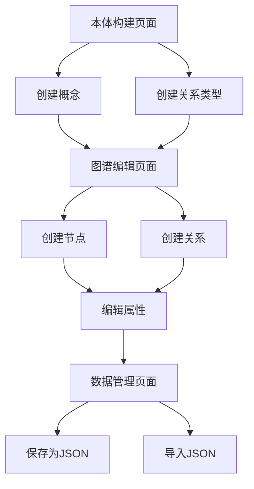

## 1. Product Overview
知识图谱可视化快速编辑工具，用于构建本体和编辑实体关系。
- 帮助用户快速构建知识图谱本体，在画布中编辑实体和关系，支持属性编辑。
- 目标用户为数据分析师、知识工程师和需要构建知识图谱的开发者。

## 2. Core Features

### 2.1 User Roles
| Role | Registration Method | Core Permissions |
|------|---------------------|------------------|
| User | 无需注册 | 完整的知识图谱编辑功能 |

### 2.2 Feature Module
1. **本体构建页面**：本体概念创建、属性定义、关系类型设置
2. **图谱编辑页面**：画布编辑、节点创建、关系创建、属性编辑
3. **数据管理页面**：数据导入导出、保存加载

### 2.3 Page Details
| Page Name | Module Name | Feature description |
|-----------|-------------|---------------------|
| 本体构建页面 | 概念管理 | 创建、编辑、删除本体概念，设置概念属性 |
| 本体构建页面 | 关系管理 | 创建、编辑、删除关系类型，设置关系属性 |
| 图谱编辑页面 | 画布操作 | 拖拽创建节点，连接节点创建关系，支持缩放和平移 |
| 图谱编辑页面 | 属性编辑 | 右侧弹窗展示节点和关系的属性编辑表单 |
| 数据管理页面 | 数据导入 | 支持从JSON文件导入图谱数据 |
| 数据管理页面 | 数据导出 | 支持导出为JSON文件，后续可扩展为Neo4j导出 |

## 3. Core Process
用户首先在本体构建页面创建概念和关系类型，然后在图谱编辑页面使用这些定义好的类型创建具体的实体和关系，最后可以保存或导出数据。

## 4. User Interface Design
### 4.1 Design Style
- 主色调：#1890ff（Ant Design蓝色）
- 辅助色：#52c41a（成功色）、#faad14（警告色）、#f5222d（错误色）
- 按钮样式：圆角矩形，有hover效果
- 字体：系统默认字体，标题16-20px，正文14px，辅助文字12px
- 布局风格：左侧导航栏，右侧主内容区，顶部操作栏
- 图标风格：Ant Design图标库

### 4.2 Page Design Overview
| Page Name | Module Name | UI Elements |
|-----------|-------------|-------------|
| 本体构建页面 | 概念管理 | 表格展示概念列表，右侧表单编辑概念属性，顶部操作按钮 |
| 本体构建页面 | 关系管理 | 表格展示关系类型列表，右侧表单编辑关系属性，顶部操作按钮 |
| 图谱编辑页面 | 画布操作 | 大尺寸画布，支持拖拽和缩放，左侧工具栏，顶部操作按钮 |
| 图谱编辑页面 | 属性编辑 | 右侧抽屉式弹窗，表单展示属性编辑项，支持添加和删除属性 |
| 数据管理页面 | 数据导入导出 | 按钮触发文件选择，进度条展示导入导出状态，操作结果提示 |

### 4.3 Responsiveness
- 桌面优先设计，支持1280px以上屏幕
- 平板设备适配，画布区域自适应
- 移动设备支持基本功能，画布操作可能受限

### 4.4 3D Scene Guidance
- 不适用3D场景，主要为2D画布操作