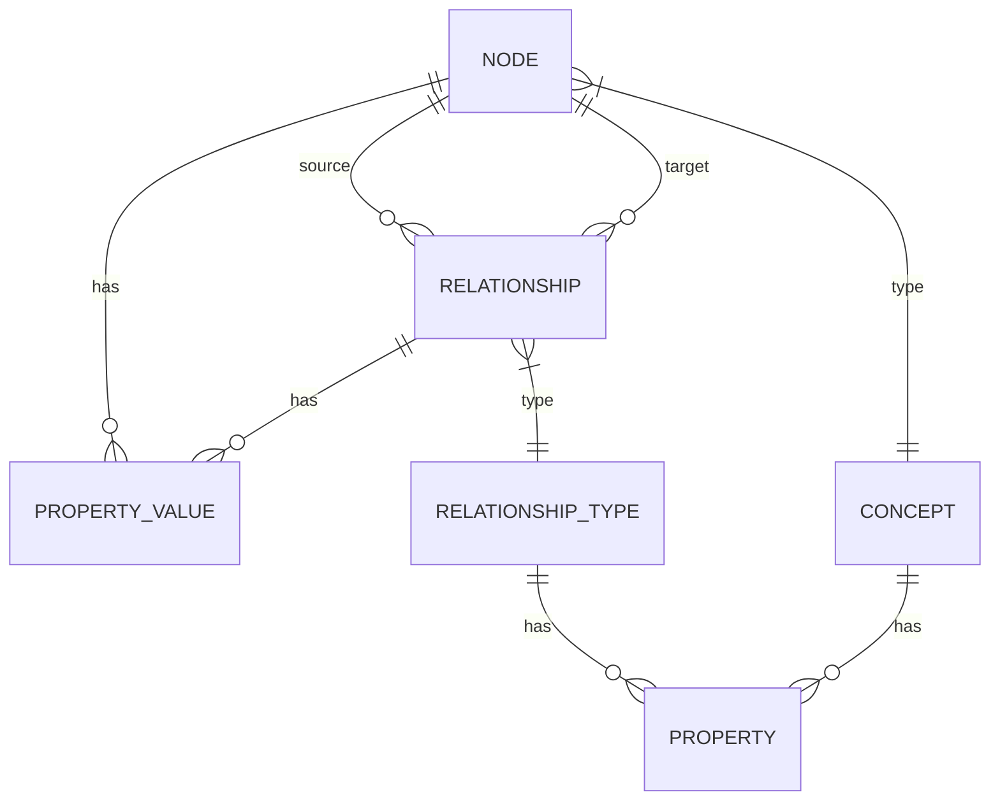

## 1. Architecture Design
```mermaid
flowchart TD
    A[Frontend React App] --> B[本体构建模块]
    A --> C[图谱编辑模块]
    A --> D[数据管理模块]
    B --> E[本地状态管理]
    C --> E
    D --> E
    E --> F[JSON文件存储]
    F --> G[Neo4j集成] (未来扩展)
    F --> H[大模型API] (未来扩展)
```

## 2. Technology Description
- Frontend: React@18 + TypeScript + Ant Design + Tailwind CSS + Vite
- State Management: Zustand
- Graph Visualization: react-flow
- Initialization Tool: vite-init
- Backend: 暂无，纯前端实现
- Database: 本地JSON文件存储，未来扩展Neo4j

## 3. Route Definitions
| Route | Purpose |
|-------|---------|
| / | 本体构建页面 |
| /graph | 图谱编辑页面 |
| /data | 数据管理页面 |

## 4. API Definitions
- 暂无后端API，纯前端实现

## 5. Server Architecture Diagram
- 不适用，纯前端实现

## 6. Data Model
### 6.1 Data Model Definition


### 6.2 Data Definition Language
#### 概念(Concept)结构
```typescript
interface Concept {
  id: string;
  name: string;
  properties: Property[];
  createdAt: string;
  updatedAt: string;
}

interface Property {
  id: string;
  name: string;
  type: 'string' | 'number' | 'boolean' | 'date';
  required: boolean;
  defaultValue?: any;
}
```

#### 关系类型(RelationshipType)结构
```typescript
interface RelationshipType {
  id: string;
  name: string;
  properties: Property[];
  createdAt: string;
  updatedAt: string;
}
```

#### 节点(Node)结构
```typescript
interface Node {
  id: string;
  conceptId: string;
  properties: Record<string, any>;
  position: { x: number; y: number };
  createdAt: string;
  updatedAt: string;
}
```

#### 关系(Relationship)结构
```typescript
interface Relationship {
  id: string;
  source: string; // node id
  target: string; // node id
  relationshipTypeId: string;
  properties: Record<string, any>;
  createdAt: string;
  updatedAt: string;
}
```

#### 图谱(Graph)结构
```typescript
interface Graph {
  concepts: Concept[];
  relationshipTypes: RelationshipType[];
  nodes: Node[];
  relationships: Relationship[];
}
```